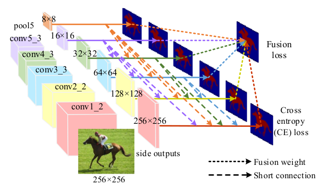
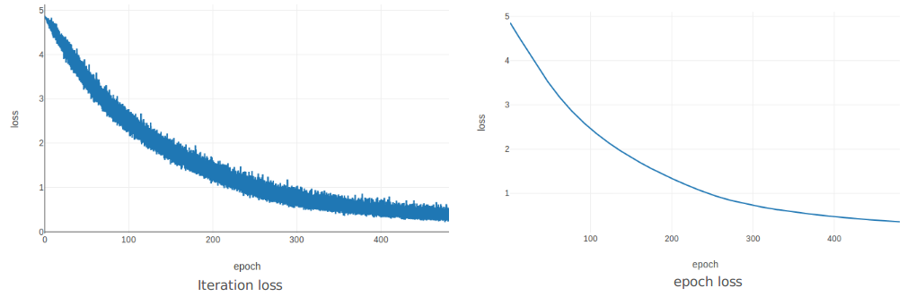
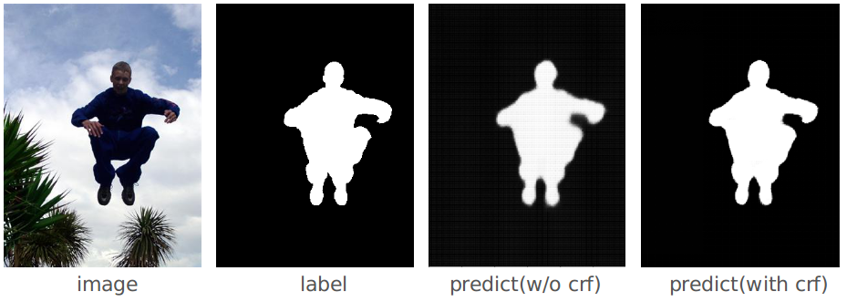
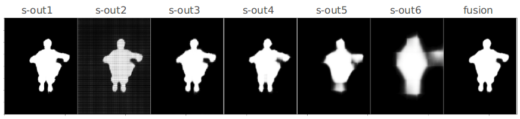

# DSS-PyTorch
PyTorch implement of [Deeply Supervised Salient Object Detection with Short Connection](https://arxiv.org/abs/1611.04849)

<p align="center"></p>

The official caffe version: [DSS](https://github.com/Andrew-Qibin/DSS)

## Prerequisites

- [Python 3](https://www.continuum.io/downloads)
- [Pytorch 0.4.1+](http://pytorch.org/)
- [torchvision](http://pytorch.org/)
- [visdom](https://github.com/facebookresearch/visdom) （optional for visualization）
- [PyDenseCRF](https://github.com/lucasb-eyer/pydensecrf)（optional for CRF post-process）

## Results

The information of Loss:



Example output:



> Note: here the "blur boundary" caused by bad combine method

Different connection output：



#### Some difference

1. The original paper use：$Z=h(\sum_{i=2}^4 f_mR^{(m)})$，here we use $Z=h(\sum_{i=1}^6 f_mR^{(m)})$ in inference stage

#### Results Reproduct

|   Dataset (MSRA-B)   | Paper | Here (v1) | Only Fusion (v1) | Here (v2) | Only Fusion (v2) | Here(v2 700) |
| :------------------: | :---: | :-------: | :--------------: | :-------: | :--------------: | :----------: |
|  MAE (without CRF)   | 0.043 |   0.054   |      0.052       |   0.068   |      0.052       |    0.051     |
| F_beta (without CRF) | 0.920 |   0.910   |      0.914       |   0.912   |      0.910       |    0.918     |
|    MAE (with CRF)    | 0.028 |   0.047   |      0.048       |   0.047   |      0.049       |    0.047     |
|  F_beta (with CRF)   | 0.927 |   0.916   |      0.917       |   0.915   |      0.918       |    0.923     |

Note：

1. v1 means use average fusion , v2 means use learnable fusion
2. You can try to use other "inference stragedy"（I think other combine can get better results --- here use sout-2+sout-3+sout-4+fusion  --- you can just change [self.select](https://github.com/AceCoooool/DSS-pytorch/blob/66419dee7045f4581e7e18f910ca98e1a596705a/solver.py#L20)）
3. v2 700 means training with 700 epochs. （I use pre-trained model by 500 epochs：so the optimizer is a little differnt to direct 700 eopch）

## Usage

### 1. Clone the repository

```shell
git clone git@github.com:AceCoooool/DSS-pytorch.git
cd DSS-pytorch/
```

### 2. Download the dataset

Download the [MSRA-B](http://mmcheng.net/zh/msra10k/) dataset. （If you can not find this dataset, email to me --- I am not sure whether it's legal to put it on BaiDuYun）

```shell
# file construction
MSRA-B
  --- annotation
      --- xxx.png
      --- xxx.png
  --- image
      --- xxx.jpg
      --- xxx.jpg
  --- test_cvpr2013.txt
  --- train_cvpr2013.txt
  --- valid_cvpr2013.txt
  --- test_cvpr2013_debug.txt
  --- train_cvpr2013_debug.txt
  --- valid_cvpr2013_debug.txt
```

### 3. Get pre-trained vgg

```bash
cd tools/
python extract_vgg.py
cd ..
```

### 4. Demo

pleease see `demo.ipynb`

Note: 

1. default choose: download and copy the [pretrained model](https://pan.baidu.com/s/10XmHVMAOp1ewoJXhI0nRgA) to `weights` directory

### 5. Train

```shell
python main.py --mode='train' --train_path='you_data' --label_path='you_label' --batch_size=8 --visdom=True --train_file='you_file'
```

Note:

1. `--val=True` add the validation (but your need to add the `--val_path`, `--val_file` and `--val_label`)
2. `you_data, you_label` means your training data root. (connect to the step 2)
3. If you Download the data to `youhome/data/MSRA-B`（you can not "implicity" the path）

### 6. Test

```shell
python main.py --mode='test' --test_path='you_data' --test_label='your_label' --use_crf=False --model='your_trained_model' --test_file='you_file'
```

Note：

1. only support `bath_size=1`
2. `--use_crf=True`：means use CRF post-process